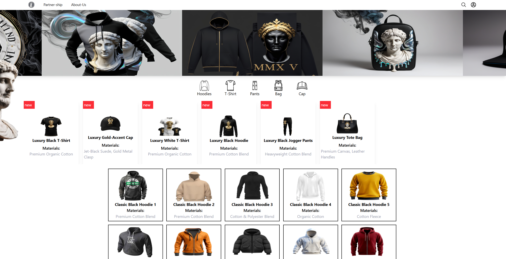

# Luxury Fashion E-commerce Website

A modern e-commerce frontend built with React and Vite, showcasing a luxury fashion brand with classical aesthetic elements.


## Preview




## Features

- Modern UI/UX with classical art elements
- Product categories: Hoodies, T-Shirts, Pants, Bags, and Caps
- Luxury collection with detailed material information
- Responsive design for all devices
- Fast performance with Vite

## Tech Stack

- React
- Vite
- JavaScript/JSX

## Installation
```bash
# Clone the repository
git clone https://github.com/piseyKhenchandara/Quamtom-project.git

# Navigate to project directory
cd Quamtom-project

# Install dependencies
npm install

# Start development server
npm run dev
```

## Available Scripts
```bash
npm run dev      # Start development server
npm run build    # Build for production
npm run preview  # Preview production build
```

## Project Structure
```
Quamtom-project/
├── .git/
├── node_modules/
├── public/
├── src/
│   ├── assets/          # Images, fonts, icons
│   ├── components/      # Reusable React components
│   ├── data/            # Static data and configurations
│   ├── layout/          # Layout components
│   ├── pages/           # Page components
│   ├── App.css          # Global styles
│   ├── App.jsx          # Main application component
│   ├── index.css        # Base styles
│   └── main.jsx         # Application entry point
├── .gitattributes
├── .gitignore
├── eslint.config.js     # ESLint configuration
├── index.html           # HTML template
├── package-lock.json
├── package.json         # Dependencies and scripts
├── README.md
└── vite.config.js       # Vite configuration
```

## Browser Support

Chrome, Firefox, Safari, Edge (latest versions)

## Repository

[https://github.com/piseyKhenchandara/Quamtom-project.git](https://github.com/piseyKhenchandara/Quamtom-project.git)
